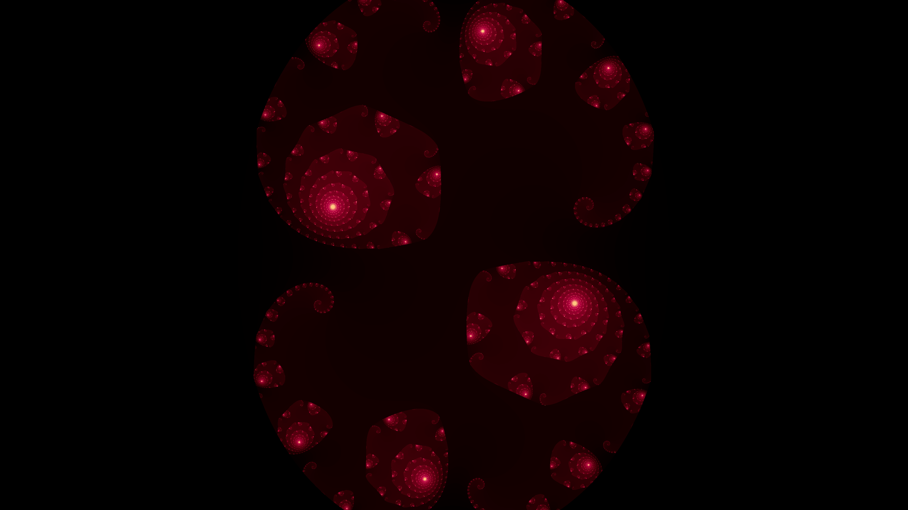
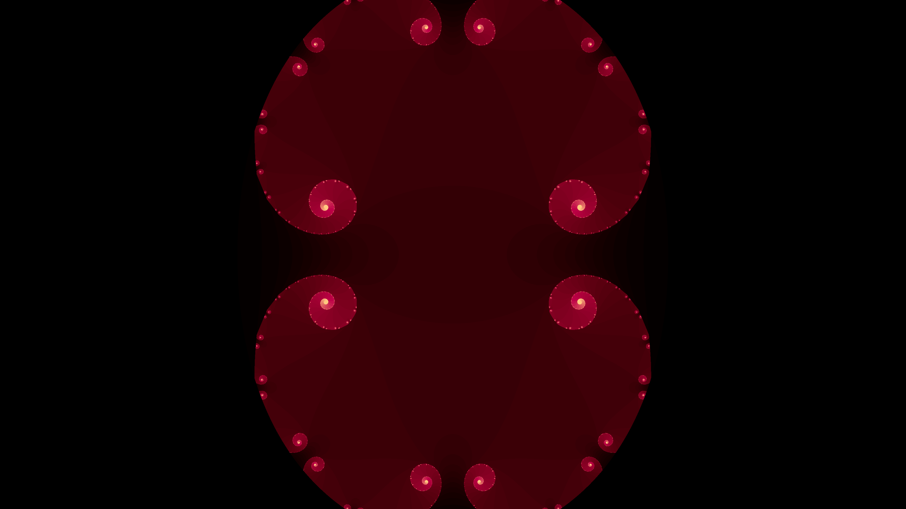

# Fractal Art Render

[](https://github.com/tao-pr/julia-set-cpp/blob/main/LICENSE)

A C++ implementation of Fractal art rendering.

## Table of Contents

- [Introduction](#introduction)
- [Features](#features)
- [Getting Started](#getting-started)
- [Usage](#usage)
- [Contributing](#contributing)
- [License](#license)

## Introduction

This project is a C++ implementation of Julia Set and other fractal seet rendering with OpenGL. One example is Julia Set which is a fractal defined by a complex quadratic polynomial. This program allows you to generate and visualize Julia Set images.

## Features

- Generate high-resolution Julia Set images
- Customize the parameters of the Julia Set
- Save the rendered images to disk

## Getting Started

To get started with Julia Set Render, follow these steps:

1. Clone the repository:

  ```shell
  git clone https://github.com/tao-pr/fractal-art-render.git
  ```

2. Install and configure prerequisites

- Latest XCode Commandline Tools
- CMake
- [LLVM Compiler](https://github.com/llvm/llvm-project/tree/main)
- [TBB](https://github.com/oneapi-src/oneTBB)
- [OpenCV4](https://opencv.org/releases/)

For MacOS users, simply run the following

```sh
# Install XCode commandline update (requires a restart)
softwareupdate --list  # list the available update for XCode Commandline Tools
softwareupdate -i <label> # install the available update (specify the label got from previous command)

# Install LLVM
brew install llvm@16
# then follow an instruction on `brew info llvm@16` to bootstrap your environment

# Install TBB
brew install tbb

# Install OpenCV
brew install opencv
```

3. Build the project and run the executable:

  ```shell
  ./make.sh && bin/julia 0 -0.75 50 0.0001
  ```

## Usage

The executable accepts the following positional arguments

```sh
./bin/julia {re} {im} {step_size} {num_iters} {scale} {fractal_type} {centre} {animation_params}
```

`{re}` and `{im}` represent a complex number (C) we want to explore a fractal set on, e.g. for Julia set (`z_next = z_current^2 + C`).

See example of arguments in the next section. After run, it will write an output image to `fractal.png`.

## Some good examples

For still image

```sh
# Simple Julia (degree2)
./make.sh && bin/julia 0.285 0.01 200 0.001
./make.sh && bin/julia 0.285 0.01 200 0.001 1 julia 0.4784,0.1832
./make.sh && bin/julia -0.4 0.6 200 0.001
./make.sh && bin/julia 0.285 0 200 0.001
./make.sh && bin/julia -0.70176 0.3842 100 0.001
./make.sh && bin/julia 0.285 0.01 200 0.001
./make.sh && bin/julia -0.835 -0.2321 100 0.001 1.2
./make.sh && bin/julia -0.7269 0.1889 500 0.001
./make.sh && bin/julia -0.7269 0.1889 500 0.001 1.5
./make.sh && bin/julia -0.3905407802 -0.5867879073 150 0.001 # Siegel disks
./make.sh && bin/julia -2 1 10 0.001 2
./make.sh && bin/julia -1.77578 0 10 0.001 2 # Peitgen et al 1992
./make.sh && bin/julia 0 1 30 0.001 2 # Dendritic

# Degree4 Julia
./make.sh && bin/julia 0.6 0.55 100 0.001 0.99 degree4
./make.sh && bin/julia -2 1 10 0.001 1.5 degree4
./make.sh && bin/julia 0 1 15 0.001 1.5 degree4

# Complex Julia
./make.sh && bin/julia 0.6 0.55 10 0.001 1.2 complex
./make.sh && bin/julia -0.3905407802 -0.5867879073 30 0.001 1 Complex
./make.sh && bin/julia -2 1 10 0.001 1.5 complex
./make.sh && bin/julia 0 1 15 0.001 1.5 complex 0.006,-0.012
```

For animation. The format of the params are "{animationType}:{numFrames}:{params=value},{params=value}"

```sh
./make.sh && bin/julia 0 1 15 0.001 1.5 complex 0.006,-0.012 zoom:48:ratio=0.95

# This will render 5 frames, zoomin step size of 0.1
```


## Samples

See sample renders in `/samples` dir.






## Contributing

Contributions are welcome! If you have any ideas, suggestions, or bug reports, please open an issue or submit a pull request.

## License

This project is licensed under the MIT License. See the [LICENSE](LICENSE) file for more information.
