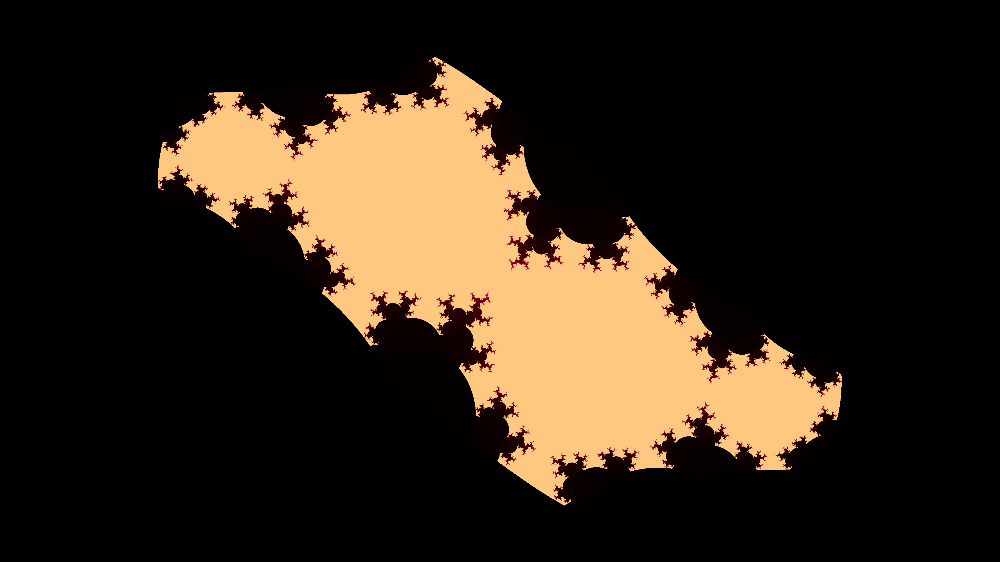

# Fractal Art Render

[](https://github.com/tao-pr/julia-set-cpp/blob/main/LICENSE)

A C++ implementation of Fractal art rendering (PNG/MP4).

## Table of Contents

- [Introduction](#introduction)
- [Features](#features)
- [Getting Started](#getting-started)
- [How to Render](#how-to-render)
- [Contributing](#contributing)
- [License](#license)

## Introduction

This project is a C++ implementation of Julia Set and other fractal seet rendering with OpenGL. One example is Julia Set which is a fractal defined by a complex quadratic polynomial. This program allows you to generate and visualize Julia Set images.

## Features

- Generate high-resolution Julia Set images (PNG)
- Generate high-resolution Julia Set animations, eg. Zoom or rotation (AC1/MP4)
- Support multiple types of Julia sets
- Customisable Julia set parameters

## Getting Started

To get started with Julia Set Render, follow these steps:

1. Clone the repository:

  ```shell
  git clone https://github.com/tao-pr/fractal-art-render.git
  ```

2. Install and configure prerequisites

- Latest XCode Commandline Tools
- CMake
- [LLVM Compiler](https://github.com/llvm/llvm-project/tree/main)
- [TBB](https://github.com/oneapi-src/oneTBB)
- [OpenCV4](https://opencv.org/releases/)

For MacOS users, simply run the following

```sh
# Install XCode commandline update (requires a restart)
softwareupdate --list  # list the available update for XCode Commandline Tools
softwareupdate -i <label> # install the available update (specify the label got from previous command)

# Install LLVM
brew install llvm@16
# then follow an instruction on `brew info llvm@16` to bootstrap your environment

# Install TBB
brew install tbb

# Install OpenCV
brew install opencv

# Install OpenH264 video codec
brew install openh264
```

3. Build the project and run the executable:

  ```shell
  ./make.sh && bin/julia 0 -0.75 50 0.0001
  ```

## How to Render

The executable accepts the following positional arguments

```sh
./bin/julia {re} {im} {step_size} {num_iters} {scale} {fractal_type} {centre} {animation_params}
```

`{re}` and `{im}` represent a complex number (C) we want to explore a fractal set on, e.g. for Julia set (`z_next = z_current^2 + C`).

See example of arguments in the next section. After run, it will write an output image to `fractal.png`.

## Still images

Some examples of how to generate Julia set render as PNG.

```sh
# Simple Julia (degree2)
./make.sh && bin/julia 0.285 0.01 200 0.001
./make.sh && bin/julia 0.285 0.01 200 0.001 1 julia 0.4784,0.1832
./make.sh && bin/julia -0.4 0.6 200 0.001
./make.sh && bin/julia 0.285 0 60 0.001
./make.sh && bin/julia -0.70176 0.3842 60 0.001
./make.sh && bin/julia 0.285 0.01 200 0.001
./make.sh && bin/julia -0.835 -0.2321 50 0.001 1.2
./make.sh && bin/julia -0.7269 0.1889 500 0.001
./make.sh && bin/julia -0.7269 0.1889 500 0.001 1.5
./make.sh && bin/julia -0.3905407802 -0.5867879073 150 0.001 # Siegel disks
./make.sh && bin/julia -2 1 10 0.001 2
./make.sh && bin/julia -1.77578 0 10 0.001 2 # Peitgen et al 1992
./make.sh && bin/julia 0 1 30 0.001 2 # Dendritic

# Degree4 Julia
./make.sh && bin/julia 0.6 0.55 70 0.001 0.99 degree4
./make.sh && bin/julia -2 1 10 0.001 1.5 degree4
./make.sh && bin/julia 0 1 15 0.001 1.5 degree4

# Complex Julia
./make.sh && bin/julia 0.6 0.55 10 0.001 1.2 complex
./make.sh && bin/julia -0.3905407802 -0.5867879073 30 0.001 1 complex
./make.sh && bin/julia -2 1 10 0.001 1.5 complex
./make.sh && bin/julia 0 1 8 0.001 1.5 complex 0.006,-0.012
```

## Animation (render as mp4)

For animation. The format of the params are "{animationType}:{numFrames}:{params=value},{params=value}". Note that for zooming, the program will always zoom into the `{centre}` coordinate of the render.

```sh
# Zoom-in animation example #1
#   300 frames (12s video)
#   Taking 13 minutes to render on Apple M1
./make.sh && bin/julia -0.835 -0.2321 50 0.0016 2 julia 0.551982975934,0.103081008008 zoom:300:ratio=0.92,decayEvery=5,decay=-5,maxIters=900


# Zoom-in animation example #2
#   192 frames (8s videos)
./make.sh && bin/julia 0.285 0.01 200 0.001 1.1 julia 0.473669791,0.188451676 zoom:192:ratio=0.92,decayEvery=3,decay=-8,maxIters=1000

# Zoom-in animation example #3
#   290 frames (12s video)
#   Taking 13 minutes to render on Apple M1
./make.sh && bin/julia -0.3905407802 -0.5867879073 20 0.001 1.3 complex 0.021882444987,0.753229532908 zoom:290:ratio=0.92,decay=-2,decayEvery=6,maxIters=800

# Zoom-in animation example #4
# This animation render is quite a CPU-heavy one, as most of its visible coordinates 
# will not escape early. It also produces significantly the largest output file.
#   210 frames (9s video)
#   Taking 47 minutes to render on Apple M1
./make.sh && bin/julia -0.7269 0.1889 500 0.0016 1.5 julia 0.497932052533,-0.098794214417 zoom:210:ratio=0.94,decay=-24,decayEvery=2,maxIters=3500


# Translation animation example #1 (real value walk)
./make.sh && bin/julia 0.285 0.01 200 0.001 1.1 julia 0.4784,0.1832 complex:25:stepRe=0.0002,decay=0

# Translation animation example #2 (imaginary walk)
./make.sh && bin/julia 0.285 0.01 200 0.001 1.1 julia 0.4784,0.1832 complex:25:stepRe=0,stepIm=0.001,decay=0
./make.sh && bin/julia 0.285 0.01 200 0.001 1.1 julia 0.4784,0.1832 complex:25:stepRe=0,stepIm=-0.001,decay=-5,decayEvery=10

# Rotation animation example #1
./make.sh && bin/julia -0.4 0.6 250 0.001 1 julia 0,0 rotate:30:decay=0,angle=0.001

# Rotation animation example #2
./make.sh && bin/julia 0.162 1.04 14 0.001 1.8 julia -0.019280780364,-0.474818652422 rotate:40:decay=0,angle=0.15707963268

# Rotation animation example #3
./make.sh && bin/julia -1.476 0 25 0.001 1.8 julia 0,0 rotate:32:angle=0.2094395102,decay=5,decayEvery=4,minIters=8
```

Rendering a sequence of Julia set zoomings takes substantial amount of work for CPU. An ARM-powered laptop (Macbook M1) could generate some amount of heat with just 10 seconds of video render (240 frames).

```
Rendering frame #117
Preparing parallel tasks...
Submitted 8610312 parallel render tasks (3912x2200)
Finished 8610312 parallel render tasks (3912x2200)
Resized from 3912 x 2200 to 1920 x 1080
bound = 4.87265e-06, res = 3.98671e-09
Rendering frame #118
Preparing parallel tasks...
Submitted 8606400 parallel render tasks (3912x2201)
Finished 8606400 parallel render tasks (3912x2201)
Resized from 3912 x 2201 to 1920 x 1080
bound = 4.38538e-06, res = 3.58804e-09
Rendering frame #119
Preparing parallel tasks...
Submitted 8610312 parallel render tasks (3912x2200)
Finished 8610312 parallel render tasks (3912x2200)
Resized from 3912 x 2200 to 1920 x 1080
Press any key to exit..
```

## Samples

See sample rendered images in `/samples` dir.





## Contributing

Contributions are welcome! If you have any ideas, suggestions, or bug reports, please open an issue or submit a pull request.

## License

This project is licensed under the MIT License. See the [LICENSE](LICENSE) file for more information.
